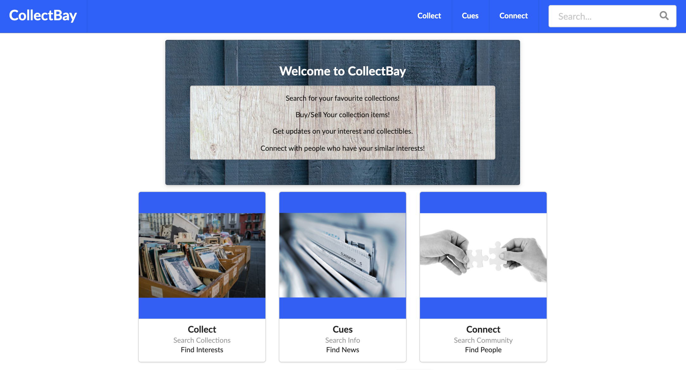

# CollectBay 

## Collect and Connect with Collectors

This app allows users to search for collections in eBay and save their own collections in a database, which later can retrieve. The app uses the following technologies:

* [Node](https://nodejs.org/en/) as the main Javascript runtime built on Chrome's V8 JavaScript engine.
* [Express](https://expressjs.com/) is a minimal and flexible Node.js web application framework that provides a robust set of features for web and mobile applications.
* [MySQL](https://www.mysql.com/) the most popular Open Source SQL database management system, which is developed, distributed, and supported by [Oracle Corporation](https://en.wikipedia.org/wiki/Oracle_Corporation).
* [Handlebars](https://handlebarsjs.com/) is a popular and powerful templating engine, simple to use and with a large community. It is based on the Mustache template language.
* [Sequelize](https://sequelize.org/) is a promise-based Node.js ORM for Postgres, MySQL, MariaDB, SQLite and Microsoft SQL Server. It features solid transaction support, relations, eager and lazy loading, read replication and more.

## Screenshot

## Deployed App in Heroku

[CollectBay Heroku](https://collectbay.herokuapp.com/)

## GitHub Repository

[CollectBay](https://github.com/tomaspz/Collect_Bay)

## Installation

It does not requiere installation. It can be used directly in Heroku.

## Configuration

